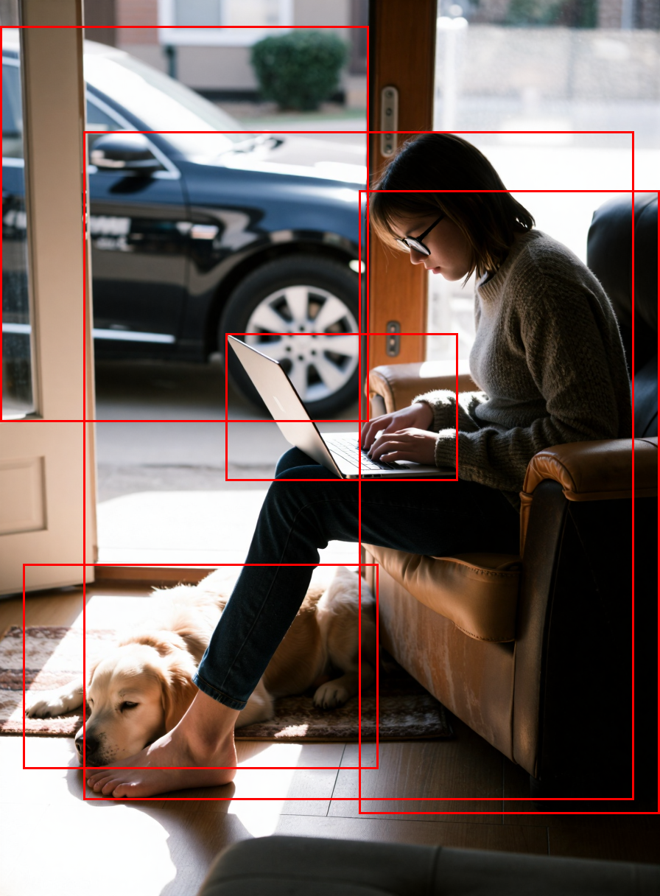

# ComfyUI LocateAnything - Example Workflows

This directory contains example workflows for the LocateAnything model integration in ComfyUI.

## Available Nodes

| Node | Category | Description |
|------|----------|-------------|
| **Load Locate Anything Model** | Loader | Loads the Locate Anything model (from HF or local path) |
| **Configure Inference** | Config | Sets inference parameters (temperature, top_p, generation mode, etc.) |
| **Detect Objects** | Detection | Detects multiple object categories in an image |
| **Ground Phrase** | Grounding/Phrase | Locates instances matching a natural language description |
| **Ground Text** | Grounding/Text | Locates specific text strings in images |
| **Point to Object** | Pointing | Points to objects using natural language |
| **GUI Grounding** | GUI Grounding | Locates GUI elements (box or point mode) |
| **Debug Model** | Debug | Inspect model state and run test inference |

---

## Supported Tasks

### 1. Object Detection

**Purpose:** Detect and locate all instances of specified object categories in an image.

**Required Nodes:**
- Load Locate Anything Model
- Detect Objects

**Inputs:**
- **Model:** The loaded Locate Anything model
- **Image:** The source image to analyze
- **Categories:** Comma-separated list of object categories (e.g., `"person,car,bicycle"`)
- **Config (optional):** Inference configuration from "Configure Inference" node

**Outputs:**
- `detection_result` - Raw model response text
- `parsed_boxes` - JSON with bounding boxes (pixel coordinates)
- `annotated_image` - Image with drawn bounding boxes

**Example Prompt:**
```
"Locate all the instances that matches the following description: person,car,bicycle."
```

**Input Image:**


**Workflow:**



---

### 2. Single/Multi Object Grounding (Phrase Grounding)

**Purpose:** Locate instances matching a natural language description.

**Required Nodes:**
- Load Locate Anything Model
- Ground Phrase

**Inputs:**
- **Model:** The loaded Locate Anything model
- **Image:** The source image
- **Phrase:** Natural language description (e.g., "the person wearing a red shirt")
- **Config (optional):** Inference configuration

**Outputs:**
- `grounding_result` - Raw model response
- `parsed_boxes` - JSON with bounding box(es)
- `annotated_image` - Image with drawn bounding boxes

**Example Prompts:**
```
"Locate a single instance that matches the following description: the person wearing a red shirt."
"Locate all the instances that match the following description: trees in the forest."
"Locate all the instances that match the following description: laptops on desks."
```

---

### 3. Text Grounding

**Purpose:** Detect and locate text regions in an image.

**Required Nodes:**
- Load Locate Anything Model
- Ground Text

**Inputs:**
- **Model:** The loaded Locate Anything model
- **Image:** The source image
- **Phrase:** Text to locate (e.g., `"text"`)

**Outputs:**
- `grounding_result` - Raw model response
- `parsed_boxes` - JSON with bounding boxes for text regions
- `annotated_image` - Image with drawn text bounding boxes

**Example:**
```
Prompt: "text"
```

---

### 4. Point-Based Localization

**Purpose:** Locate specific points in an image using natural language.

**Required Nodes:**
- Load Locate Anything Model
- Point to Object

**Inputs:**
- **Model:** The loaded Locate Anything model
- **Image:** The source image
- **Phrase:** Description of the point to locate

**Outputs:**
- `pointing_result` - Raw model response
- `parsed_points` - JSON with point coordinates
- `annotated_image` - Image with drawn points

**Example Prompts:**
```
"Point to: the center of the image."
"Point to: the brightest spot in the image."
"Point to: the traffic light."
```

---

### 5. GUI Grounding (Box Mode)

**Purpose:** Locate GUI elements or regions in screenshots.

**Required Nodes:**
- Load Locate Anything Model
- GUI Grounding

**Inputs:**
- **Model:** The loaded Locate Anything model
- **Image:** Screenshot or GUI image
- **Phrase:** GUI element description (e.g., "the search button")
- **Output Type:** `"box"` (default) or `"point"`

**Outputs:**
- `gui_result` - Raw model response
- `parsed_output` - JSON with bounding boxes or points
- `annotated_image` - Image with drawn results

**Example Prompts:**
```
"Locate the region that matches the following description: the search button."
"Locate the region that matches the following description: the window close button."
```

---

### 6. GUI Grounding (Point Mode)

**Purpose:** Point to specific GUI elements for precise localization.

**Required Nodes:**
- Load Locate Anything Model
- GUI Grounding

**Inputs:**
- **Model:** The loaded Locate Anything model
- **Image:** Screenshot or GUI image
- **Phrase:** GUI element description
- **Output Type:** `"point"`

**Outputs:**
- `gui_result` - Raw model response
- `parsed_output` - JSON with point coordinates
- `annotated_image` - Image with drawn points

**Example Prompts:**
```
"Point to: the minimize button."
"Point to: the application icon."
```

---

## Generation Mode Selection

| Mode | Speed | Best For |
|------|-------|----------|
| `hybrid` | Balanced | General-purpose use, best overall results |
| `direct` | Faster | Simpler tasks |

**Recommendation:** Use `"hybrid"` as the default for most workflows.

---

## Coordinate Systems

All bounding boxes and points are returned in **pixel coordinates** relative to the original image size:
- `x1`, `y1`: Top-left corner coordinates
- `x2`, `y2`: Bottom-right corner coordinates
- Points: Single `(x, y)` coordinate pair

---

## Quick Start Example

```
1. Load Locate Anything Model
   ├─ model_path: "nvidia/LocateAnything-3B"
   ├─ dtype: "auto"
   └─ attention_implementation: "sdpa"

2. (Optional) Configure Inference
   ├─ max_new_tokens: 2048
   ├─ temperature: 0.7
   ├─ top_p: 0.9
   └─ generation_mode: "hybrid"

3. Detect Objects
   ├─ locate_anything: [from node 1]
   ├─ image: [load image from disk]
   └─ categories: "person,car,bicycle"
   ↓
4. Outputs:
   ├─ detection_result → [Show Text]
   ├─ parsed_boxes → [Show JSON]
   └─ annotated_image → [Save Image]
```

---

## Contributing

Please add new workflow examples to this directory. Each example should:
1. Describe the use case
2. List required nodes
3. Provide example prompts
4. Include any special configuration notes